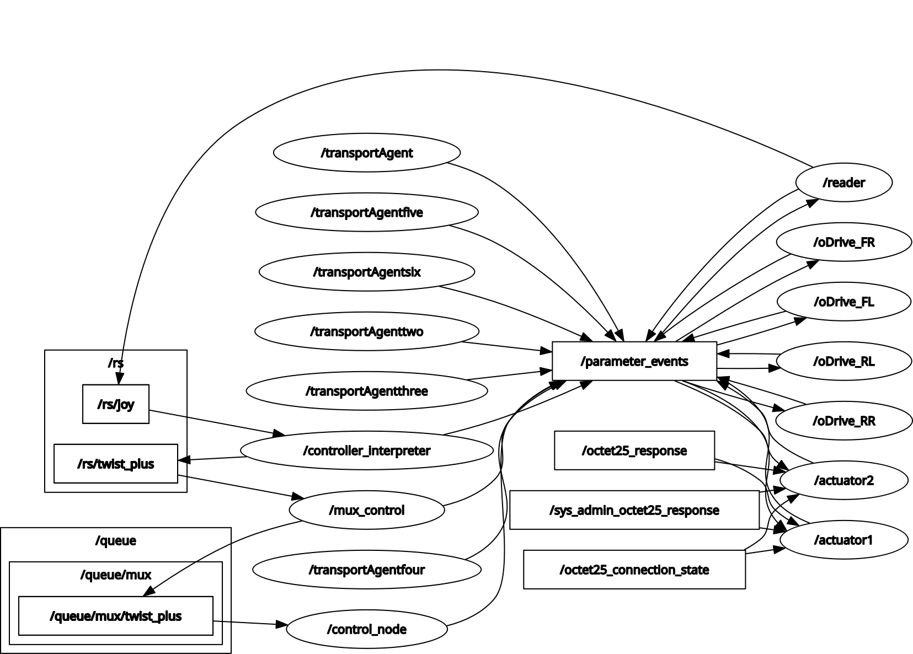

# 2024-2025 Robot Code
This repo contains the code for neccessary for the UA NASA Robotics' 2024-2025 robot's operation, meaning: all code run on the SBC (single board computers/jetson), all code run on the MCU's (arduinos), and all code run on the remote station (RS).

### File Structure
There are three main folder at top level: ROS, Docs, and Other. ROS holds the packages that use ROS to run (including the ROI program), Docs hold documents related to the operation of the Robot as well as example used while writing code, and Other holds miscellanous files.

### ROI
The ROI repo is installed as a submodule. When cloning the repository, run `git submodule init` and `git submodule update` to clone the latest ROI code into your workspace.

### gahh
This is a virtual enviroment that was used to download the ros2keyboard dependencies and is needed for the program to run properly.

## ROS Diagram



Above is a Diagram created using rqt showing the flow of data through our architecture. 
> **NOTE:** The diagram does not include the services

1. **ROI Package:** This pacakge sends/receives data to/from the MCU's using ROI. This is what allows us to control the motors.
2. **Queue Package:** This package determines whether our movements are based off of autonomous inputs or human/RS inputs. It also holds a qeue for any multi movement commands. For example if someone was to press a button to lower the bucket and move forward, that sequence would be stored here.
3. **Autonomous:** This package as the name implies is the autonomy. Note that the actual package will have more than one node.
4. **RS Package:** The RS (or Remote Station) Package takes input from a user and parses them into the ROS dataflow. This will allow human control.

## Running The Robot

### Initializing the submodules
This project contains two submodules, the ROI modules and the keyboard module. To properly run the code both need to be properly initialized, to do so run the following commands in a terminal:

```shell
git submodule init
git submodule update
```

### Installing Dependencies for the Keyboard Module
The keyboard modules can be installed using the following command in a terminal:

```shell
sudo apt install libsdl1.2-dev
```

### Building and Sourcing
We must first build the code before running it. To do so cd into './2024-2025-ROBOT-CODE/ROS' then type:
```shell
colcon build
```

Once done building source the code using:
```shell
source install/setup.bash
```
### Running code
Finally run the code with the following (each in its own terminal):
```shell
ros2 launch rs_package rs_package.xml
ros2 launch queue_package queue_package_launch.xml
ros2 launch roi_ros roi_launch.xml
```

> **NOTE:** If you are having trouble running these commands, ensure that ROS2 is installed and sourced properly.